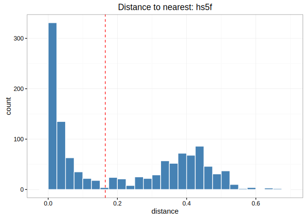

.. _Cloning:

Clustering sequences into clonal groups
================================================================================

Determining clustering threshold
--------------------------------------------------------------------------------

Before running :ref:`DefineClones`, it is important to determine an
appropriate threshold for trimming the hierarchical clustering into B cell
clones. The ``distToNearest`` function in the ``shazam`` R package calculates
the distance between each sequence in the data and its nearest neighbor. The
resulting distribution is bimodal, with the first mode representing sequences
with clonal relatives in the dataset and the second mode representing singletons.
The ideal threshold for separating clonal groups is the value that separates
the two modes of this distribution. The function allows selection of all
parameters that are available in :ref:`DefineClones`. Using the length
normalization parameter ensures that mutations are weighted equally
regardless of junction sequence length. For the database file in the
`Change-O example files <http://clip.med.yale.edu/changeo/rtd/Changeo_Example.tar.gz>`__
whose distance to nearest neighbor distribution is shown below, the threshold
we select is 0.165, shown by the red dotted line.

.. seealso::

    :download:`Download commands <scripts/DistNearest.R>` to generate
    the distance to nearest neighbor distribution.

Assigning clones
--------------------------------------------------------------------------------

There are several parameter choices when grouping Ig sequences into B cell
clones. Setting the parameter :option:`--act set <DefineClones bygroup --act>`
accounts for ambiguous V and J gene calls when grouping similar sequences. The
distance metric :option:`--model hs5f <DefineClones bygroup --model>`
incorporates somatic hypermutation biases using a human fivemer model. Because
the ``hs5f`` distance model is not symmetric, :option:`--sym min <DefineClones bygroup --sym>`
defines the distance to be the minimum of the mutating from sequence A to
sequence B and mutating from sequence B to sequence A. Because the threshold
was generated using length normalized distances, the
:option:`--norm len <DefineClones bygroup --norm>` option is selected with the
resultant threshold :option:`--dist 0.165 <DefineClones bygroup --dist>`.
The `Change-O example files <http://clip.med.yale.edu/changeo/rtd/Changeo_Example.tar.gz>`__
contain the database file on which to run the command below::

    DefineClones.py bygroup -d S43_db-pass_parse-select.tab --act set --model hs5f \
    --sym min --norm len --dist 0.165